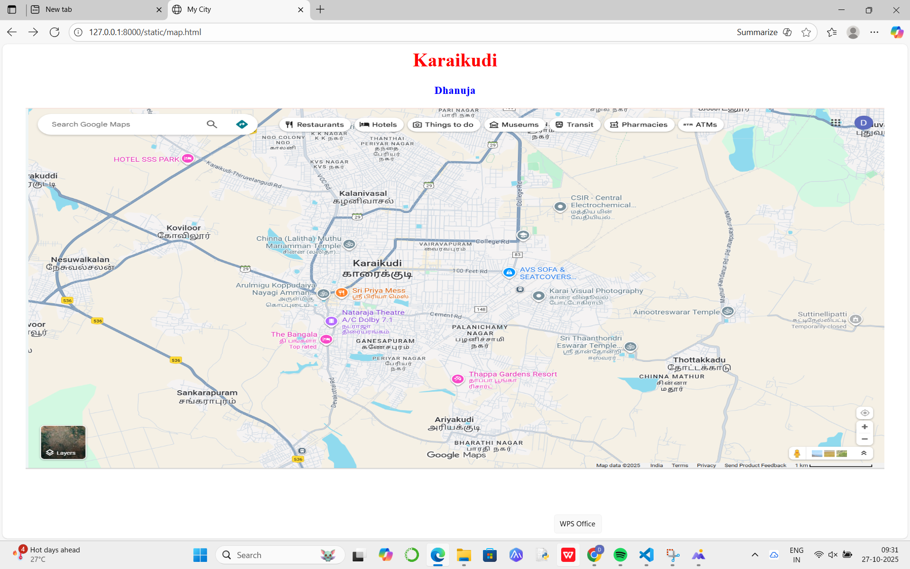
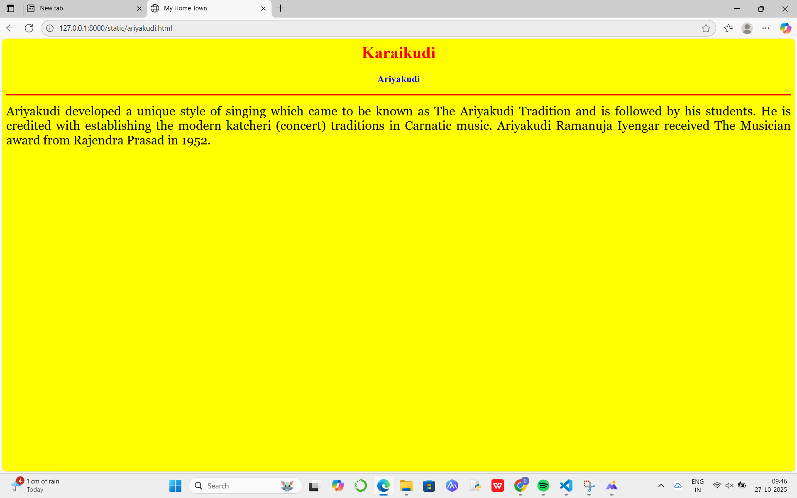
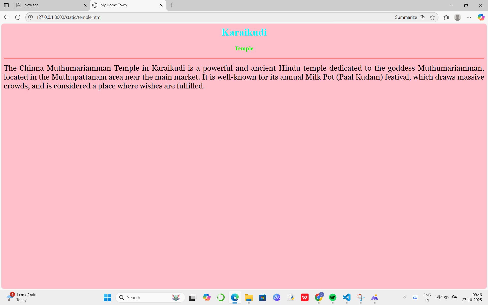
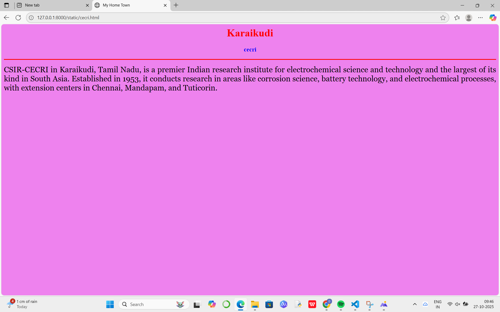

# Ex04 Places Around Me
## Date: 27/10/2025

## AIM
To develop a website to display details about the places around my house.

## DESIGN STEPS

### STEP 1
Create a Django admin interface.

### STEP 2
Download your city map from Google.

### STEP 3
Using ```<map>``` tag name the map.

### STEP 4
Create clickable regions in the image using ```<area>``` tag.

### STEP 5
Write HTML programs for all the regions identified.

### STEP 6
Execute the programs and publish them.

## CODE
```
map.html

<html>
<head>
<title>My City</title>
</head>
<body>
<h1 align="center">
<font color="red"><b>Karaikudi</b></font>
</h1>
<h3 align="center">
<font color="blue"><b>Dhanuja</b></font>
</h3>
<center>

<map name="MyCity">
<area shape="rect" coords="700,250,850,400" href="home.html" title="My Home Town">
<area shape="rect" coords="600,500,200,30" href="home.html" title="Ariyakudi">
<area shape="rect" coords="1120,360,900,900" href="home.html" title="cecri">
<area shape="rect" coords="950,120,1100,140" href="home.html" title="Temple">
</map>
</center>
</body>
</html>

ariyakudi.html

<html>
    <head>
        <title>My Home Town</title>
    </head>
    <body bgcolor="yellow">
        <h1 align="center">
            <font color="red"><b> Karaikudi</b></font>
        </h1>
        <h3 align="center">
            <font color="blue"><b>Ariyakudi</b></font>
        </h3>
        <hr size="3" color="red">
        <p align="justify">
            <font face="Georgia" size="5">
                Ariyakudi developed a unique style of singing which came to be known as The Ariyakudi Tradition and is followed by his students. 
                He is credited with establishing the modern katcheri (concert) traditions in Carnatic music. 
                Ariyakudi Ramanuja Iyengar received The Musician award from Rajendra Prasad in 1952.
            </font>
        </p>
    </body>
</html>

cecri.html

<html>
    <head>
        <title>My Home Town</title>
    </head>
    <body bgcolor="violet">
        <h1 align="center">
            <font color="red"><b> Karaikudi</b></font>
        </h1>
        <h3 align="center">
            <font color="blue"><b>cecri</b></font>
        </h3>
        <hr size="3" color="red">
        <p align="justify">
            <font face="Georgia" size="5">
                CSIR-CECRI in Karaikudi, Tamil Nadu, is a premier Indian research institute for electrochemical science and technology and the largest of its kind in South Asia. 
                Established in 1953, it conducts research in areas like corrosion science, battery technology, and electrochemical processes, with extension centers in Chennai, Mandapam, and Tuticorin.
            </font>
        </p>
    </body>
</html>

temple.html

<html>
    <head>
        <title>My Home Town</title>
    </head>
    <body bgcolor="pink">
        <h1 align="center">
            <font color="cyan"><b> Karaikudi</b></font>
        </h1>
        <h3 align="center">
            <font color="lime"><b>Temple</b></font>
        </h3>
        <hr size="3" color="red">
        <p align="justify">
            <font face="Georgia" size="5">
                The Chinna Muthumariamman Temple in Karaikudi is a powerful and ancient Hindu temple dedicated to the goddess Muthumariamman, located in the Muthupattanam area near the main market. 
                It is well-known for its annual Milk Pot (Paal Kudam) festival, which draws massive crowds, and is considered a place where wishes are fulfilled. 
            </font>
        </p>
    </body>
</html>

```

## OUTPUT






## RESULT
The program for implementing image maps using HTML is executed successfully.
